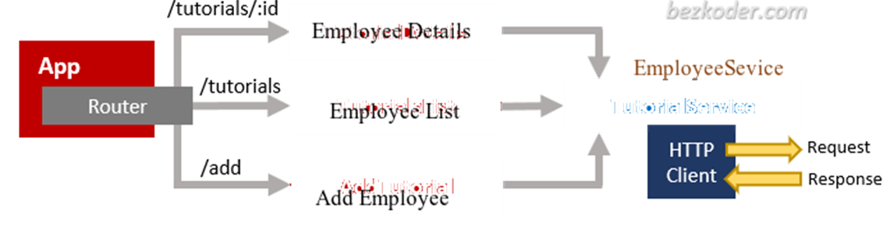
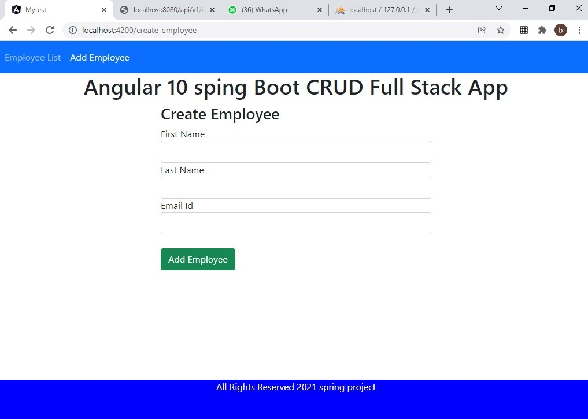
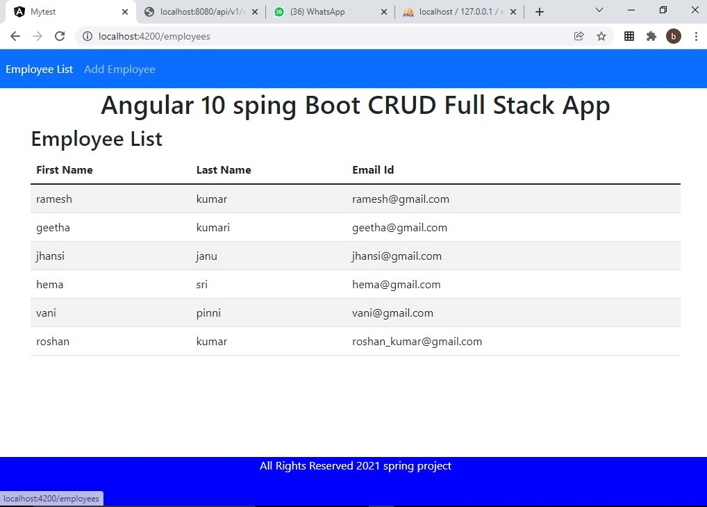

# OSD

first we need to install java, the need to download sts(Spring tool suit)

then install xampp software for mysql database.

open the xampp php myadmin and then create the database name employeemanagementsystem.

then open our application is sts we need to import the software and run the main file

by using spring boot app.
once the application is running our webservices or ready to use.

now to develop the single page application we are using anuglar.
we need to first install nodejs software
then install the angular using angular cli

now open our application mytest in cmd type the command

npm i 

the above command install all the packages.
once all the packages are installed successfully we need to start the server

ng server

the above command start the angular server in port number 4200

now open the browser and type

localhost:4200

then our client page will opens

------------------------------------------------------------------

OOSD-Project:
I have implemented a spa application using angular framework and i have used java for the backend.

Database: MySQL

The back-end server uses Spring Boot with Spring Web MVC for REST Controller and Spring Data JPA for interacting with MySQL database. Front-end side is made with Angular 10, HTTP Client & Router.

Angular & Spring Boot Architecture:
This is the application architecture we will build:
 

Spring Boot exports REST Apis using Spring Web MVC & interacts with MySQL Database using Spring Data JPA.
– Angular Client sends HTTP Requests and retrieve HTTP Responses using HTTP Client Module, shows data on the components. We also use Angular Router for navigating to pages.

Technology
•	Java 8
•	Spring Boot 2.2.1 (with Spring Web MVC, Spring Data JPA)
•	MySQL
•	Maven 3.6.1

 
We can create, retrieve, update, delete employee.

Enter the Employee First Name, Last Name, Email Id and click Add Employee button 
The employee will be created with the following field details.

 

Angular 10 Front-end:
 

 The App component is a container with router-outlet. It has navbar that links to routes paths via routerLink.
– Employees List component gets and displays Employee’s.
– Employee component has form for editing Employee’s details based on :id.
– Add Employee component has form for submission new Employee.
– These Components call Employee Service methods which use Angular HTTP Client to make HTTP requests and receive responses.
Technology
•	Angular 10
•	Angular HTTP Client
•	Angular Router

SCREENSHOTS:

<video src="https://github.com/Vyshnaviiii/OSD/blob/main/oosd execution.mp4" controls="controls" muted="muted" class="d-block rounded-bottom-2 width-fit" style="max-height:640px;">
  </video>
